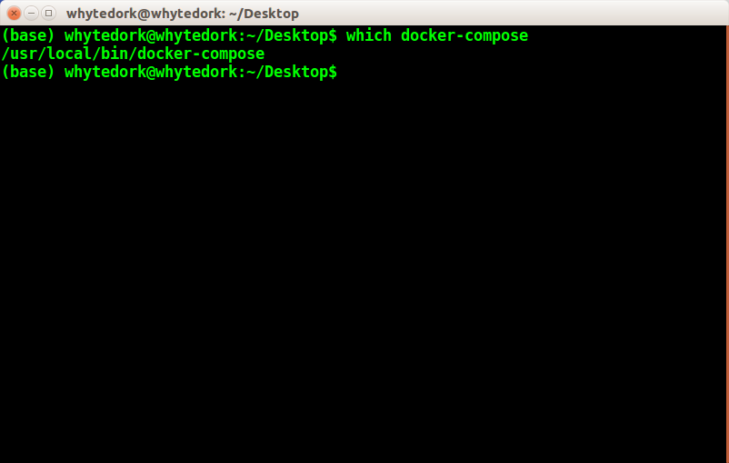
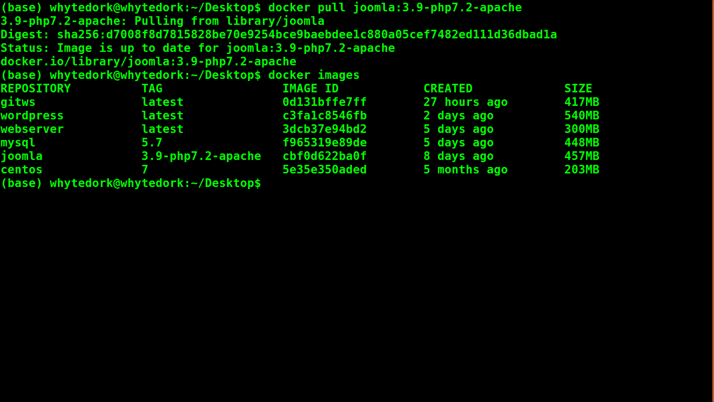
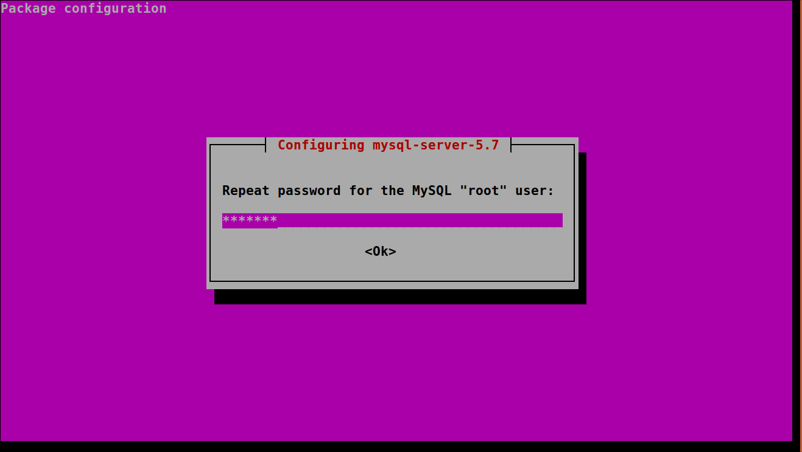
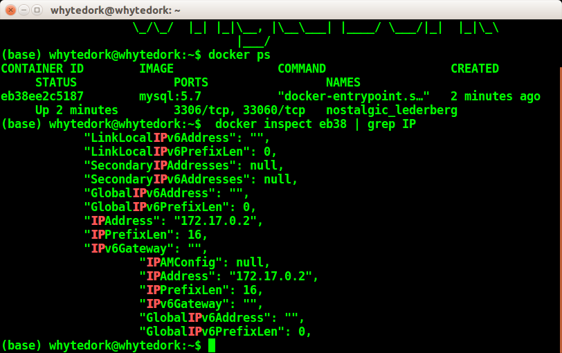
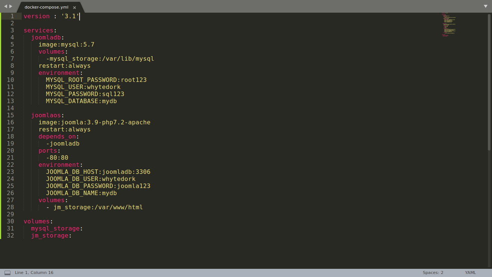

+ Launch Joomla using docker-compose
+ used mysql : 5.7 as database server
+ Joomla is a free and open-source content management system for publishing web content, developed by Open Source Matters, Inc. It is built on a model–view–controller web application framework that can be used independently of the CMS.

